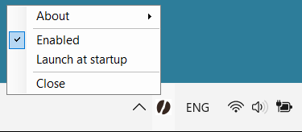

# CoffeeBean
<br>
An utility to prevent a policy-enforced screen lock in Windows.<br>
Sometimes Windows is configured to lock the screen after some time of inactivity.<br>
In case this option is enforced by corporate IT policies, it impossible to disable it via Windows settings.<br>
This utility was created as a convenient and reliable way to solve this problem.

# System requirements
The application uses `.Net Framework 4.6.1` which is already present on any version of `Windows 10` and `Windows 11`.

# How to install
* Download `CoffeeBean.exe.zip` (portable executable) or `CoffeeBean.msi` from the latest [release](https://github.com/PolarGoose/CoffeeBean/releases)
* Run the installer if you want to install the application. The installer will install into a `%AppData%\CoffeeBean` folder and create a desktop icon.

# How to use
* Start the application and you will get an icon in the system tray
* As you keep this tool running it prevents the screen from auto locking
* You can still lock the screen manually, if you want, by using Windows default methods/shortcuts (for example by pressing `Win+L`)
* To close the utility, click `Close` in the tray icon context menu. After utility is closed, screen locking behavior returns to what it was before you started the utility
* Use `Launch at startup` context menu item if you want the application to run automatically when Windows starts.
* Use `Enable` context menu item to enable or disable screen lock prevention functionality.

## Running the application from console
There are command line arguments to control screen lock functionality. You can use them in the following way:
* Launch the application with screen lock prevention functionality enabled or enable screen lock prevention functionality of already running instance of the application:
```
CoffeeBean.exe enable
```
* Launch the application with screen lock prevention functionality disabled or disable screen lock functionality of already running instance of the application:
```
CoffeeBean.exe disable
```

# How it works
The application uses [SetThreadExecutionState](https://docs.microsoft.com/en-us/windows/win32/api/winbase/nf-winbase-setthreadexecutionstate)  WinAPI method which allows an application to keep system "in use" even if there is no user activity. It is better than simulating key presses or mouse movements. For instance, it is the function which is used by video players to keep the screen on while playing a video.

# How to build
* Use `Visual Studio 2022` with [Wix Toolset Visual Studio 2022 Extension](https://marketplace.visualstudio.com/items?itemName=WixToolset.WixToolsetVisualStudio2022Extension) and [Wix Toolset](https://wixtoolset.org/releases/)
* Run `github/workflows/build.ps1` to build a release (to run this script `git.exe` should be in your PATH)

# References
* [Discussion of the screen locking problem on StackExchange](https://superuser.com/questions/329758/how-can-i-prevent-a-policy-enforced-screen-lock-in-windows)
